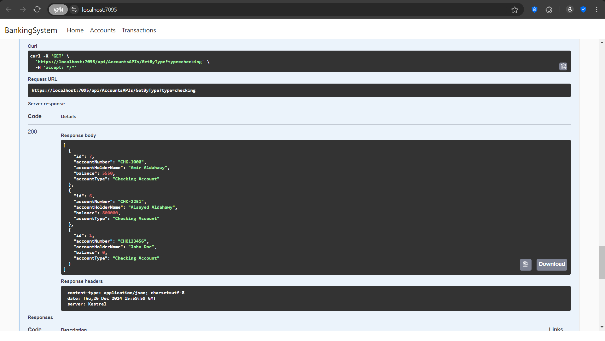

# Banking System 

A simple banking system application built with ASP.NET Core and Entity Framework Core. This project demonstrates the use of inheritance, database operations, and persistent ID generation.

This solution was developed to fulfill an entry-level task required by Paysky as part of their job application process.

## Installation

### Prerequisites

- [.NET SDK](https://dotnet.microsoft.com/download) (version 6.0 or later)
- [SQL Server](https://www.microsoft.com/en-us/sql-server/sql-server-downloads) or another compatible database

### Setup

1. **Clone the repository**:
    ```bash
    git clone https://github.com/alsayedaldahawy/bankingsystem.git
    cd bankingsystem
    ```

2. **Configure the database connection string**:
   - Open `appsettings.json` and update the connection string to point to your database:
    ```json
    {
        "ConnectionStrings": {
            "MyConnection": "YourConnectionStringHere"
        }
    }
    ```

3. **Restore dependencies**:
    ```bash
    dotnet restore
    ```

4. **Apply database migrations**:
    ```bash
    dotnet ef migrations add InitialCreate
    dotnet ef database update
    ```

5. **Run the application**:
    ```bash
    dotnet run
    ```


### Screenshots

Here are some screenshots demonstrating the application: 

#### Swagger Page: 





### Usage
** Note: 
if the https Urls didn't work for any reason, please use http://localhost:5195 instead.
- Navigate to `https://localhost:7095/` to access the Swagger Documentation.
- Navigate to `https://localhost:7095/api/accounts` to access the Accounts API.
- Navigate to `https://localhost:7095/api/transactions` to access the Transactions API.

### Example API Requests

#### Deposit
```bash
curl -X POST https://localhost:7095/api/accounts/deposit \
    -H "Content-Type: application/json" \
    -d '{   
        "accountId": 123,
        "amount": 100.0
    }'

 ```


### Project Hierarchy
```

📦 
├─ .gitignore
├─ BankingSystem.csproj
├─ BankingSystem.sln
├─ Controllers
│  ├─ AccountsController.cs
│  ├─ HomeController.cs
│  ├─ TransactionsController.cs
│  └─ accounts.cs
├─ Data
│  └─ AppDbContext.cs
├─ Dtos
│  ├─ AccountDto.cs
│  ├─ DepositDto.cs
│  ├─ TransactionDto.cs
│  └─ TransferDto.cs
├─ Models
│  ├─ Account.cs
│  ├─ CheckingAccounts.cs
│  ├─ ErrorViewModel.cs
│  ├─ SavingsAccounts.cs
│  └─ Transaction.cs
├─ Program.cs
├─ Properties
│  └─ launchSettings.json
├─ README.md
├─ Utilities
│  ├─ AccountNumberGenerator.cs
│  ├─ IdStorage.cs
│  ├─ TransactionIdGenerator.cs
│  └─ savedData.json
├─ Views
│  ├─ Accounts
│  │  └─ Index.cshtml
│  ├─ Home
│  │  └─ Index.cshtml
│  ├─ Shared
│  │  ├─ Error.cshtml
│  │  ├─ _Layout.cshtml
│  │  ├─ _Layout.cshtml.css
│  │  └─ _ValidationScriptsPartial.cshtml
│  ├─ Transactions
│  │  └─ index.cshtml
│  ├─ _ViewImports.cshtml
│  └─ _ViewStart.cshtml
├─ appsettings.Development.json
├─ appsettings.json
├─ assets
│  ├─ s1.png
│  └─ s2.png
└─ wwwroot
   ├─ css
   │  └─ site.css
   ├─ favicon.ico
   ├─ js
   │  └─ site.js
   └─ lib
      ├─ bootstrap
      │  └─ LICENSE
      ├─ jquery-validation-unobtrusive
      │  ├─ LICENSE.txt
      │  ├─ jquery.validate.unobtrusive.js
      │  └─ jquery.validate.unobtrusive.min.js
      ├─ jquery-validation
      │  └─ LICENSE.md
      └─ jquery
         └─ LICENSE.txt
```
